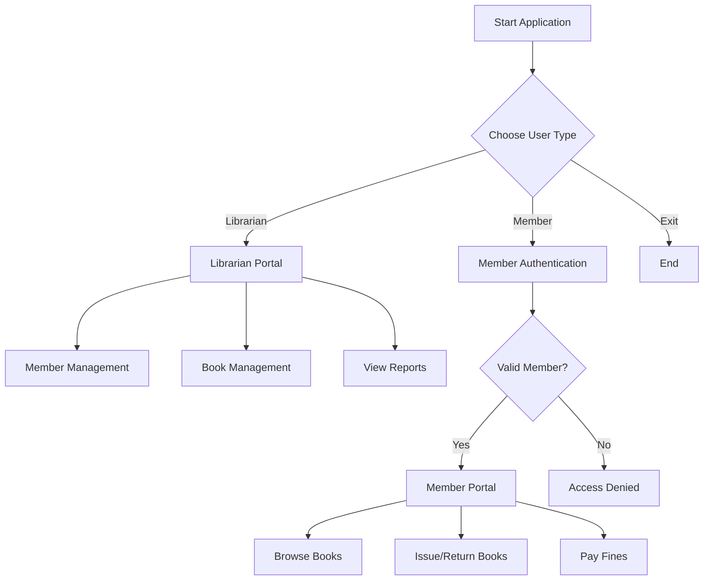

# 📚 LibraryVault - Modern Library Management System
🔗 [Project Overview](https://claude.ai/public/artifacts/df1f1c5b-c7cb-4d62-8017-b9aa152083a7)


<div align="center">
  <h3>🎯 A comprehensive library management system built with Java</h3>
  <p>Streamline your library operations with powerful member management, book tracking, and automated fine calculations</p>
</div>

---

## 🌟 Features

### 👨‍💼 **Librarian Portal**
- ✅ **Member Management**: Register new members with unique IDs and phone verification
- ✅ **Inventory Control**: Add/remove books with multiple copy support
- ✅ **Financial Oversight**: View all member fines and payment status
- ✅ **Complete Monitoring**: Access to all books and member information
- ✅ **System Administration**: Full control over library operations

### 👤 **Member Portal**
- 📖 **Book Discovery**: Browse available books in real-time
- 📚 **Personal Library**: View your currently borrowed books
- 🔄 **Quick Transactions**: Issue and return books instantly
- 💳 **Fine Management**: Pay outstanding fines securely
- 📊 **History Tracking**: Monitor your borrowing activity

### 🚀 **System Features**
- ⏰ **Real-time Tracking**: Live monitoring of book issue/return times
- 💰 **Smart Fine System**: Automatic calculation (Rs. 3 per second after 10-second grace period)
- 🔐 **Secure Authentication**: Name and phone number verification
- 📱 **User-friendly Interface**: Clean console-based interaction
- 🎯 **Dual Access**: Separate portals for librarians and members

---

## 🛠️ Technology Stack

| Component | Technology |
|-----------|------------|
| **Language** | Java |
| **Architecture** | Object-Oriented Programming |
| **Data Structures** | ArrayList, Scanner |
| **Time Management** | Java Time API (Instant, Duration) |
| **Input/Output** | Console-based interface |
| **Design Pattern** | Modular class structure |

---

## 📁 Project Structure

```
LibraryVault/
├── src/
│   ├── practice.java          # Main application entry point
│   ├── lib.java              # Menu and UI helper class
│   ├── member.java           # Member management functionality
│   └── books.java            # Book and transaction management
├── docs/
│   └── screenshots/          # Application screenshots
├── README.md                 # Project documentation
└── LICENSE                   # MIT License
```

---

## 🚀 Getting Started

### Prerequisites
- Java Development Kit (JDK) 8 or higher
- Any Java IDE (IntelliJ IDEA, Eclipse, VS Code) or command line

### Installation

1. **Clone the repository**
   ```bash
   git clone https://github.com/yourusername/LibraryVault.git
   cd LibraryVault
   ```

2. **Compile the Java files**
   ```bash
   javac *.java
   ```

3. **Run the application**
   ```bash
   java practice
   ```

### Quick Start Guide

1. **Launch the application** - You'll see the main menu with three options
2. **Choose user type**:
   - `1` - Enter as Librarian (full system access)
   - `2` - Enter as Member (limited access with authentication)
   - `3` - Exit the system

3. **For Librarians**: Access all management features directly
4. **For Members**: Enter your name and phone number to authenticate

---

## 💡 Usage Examples

### Registering a New Member
```
1. Enter as a librarian
2. Select "Register a member"
3. Enter member details:
   - Name: John Doe
   - Age: 25
   - Phone: 1234567890
4. System assigns unique Member ID
```

### Issuing a Book
```
1. Enter as a member
2. Authenticate with name and phone
3. Select "Issue book"
4. Enter BookID and book title
5. Book is issued instantly (if available)
```

### Fine Calculation Example
```
Issue Time: 10:00:00
Return Time: 10:00:15
Grace Period: 10 seconds
Delay: 5 seconds
Fine: 5 × Rs. 3 = Rs. 15
```

---

## 🎮 System Workflow



---

## 🔧 Core Classes

### `lib` - User Interface
- `printMenu()` - Displays librarian options
- `printMenu1()` - Displays member options

### `member` - Member Management
- `register()` - Register new members
- `removeMembers()` - Remove existing members
- `check()` - Authenticate member login
- `viewMembers()` - Display all members

### `books` - Book & Transaction Management
- `addbook()` - Add new books to inventory
- `removebook()` - Remove books from system
- `issuebook()` - Handle book issuing
- `returnbook()` - Process book returns
- `payfine()` - Manage fine payments

---

## 🐛 Known Issues & Future Enhancements

### Current Limitations
- Console-based interface only
- No persistent data storage
- Single-session operation
- Limited error handling for edge cases

### Planned Improvements
- [ ] **Database Integration** - MySQL/PostgreSQL support
- [ ] **GUI Implementation** - JavaFX or Swing interface
- [ ] **Data Persistence** - File-based storage system
- [ ] **Advanced Reporting** - Generate detailed reports
- [ ] **Book Search** - Advanced search and filtering
- [ ] **Email Notifications** - Automated reminders
- [ ] **Backup System** - Data backup and recovery
- [ ] **Multi-library Support** - Handle multiple library branches

---

## 🤝 Contributing

We welcome contributions from the community! Here's how you can help:

1. **Fork the repository**
2. **Create a feature branch**
   ```bash
   git checkout -b feature/amazing-feature
   ```
3. **Commit your changes**
   ```bash
   git commit -m 'Add some amazing feature'
   ```
4. **Push to the branch**
   ```bash
   git push origin feature/amazing-feature
   ```
5. **Open a Pull Request**

### Contribution Guidelines
- Follow Java naming conventions
- Add comments for complex logic
- Update documentation for new features
- Test your changes thoroughly

---

## 📸 Screenshots

<div align="center">
  
  
</div>

<div align="center">
  
  
</div>

---

## 📄 License

This project is licensed under the MIT License - see the [LICENSE](LICENSE) file for details.

```
MIT License

Copyright (c) 2025 LibraryVault

Permission is hereby granted, free of charge, to any person obtaining a copy
of this software and associated documentation files (the "Software"), to deal
in the Software without restriction, including without limitation the rights
to use, copy, modify, merge, publish, distribute, sublicense, and/or sell
copies of the Software, and to permit persons to whom the Software is
furnished to do so, subject to the following conditions:

The above copyright notice and this permission notice shall be included in all
copies or substantial portions of the Software.
```

---

## 👨‍💻 Author

**Your Name**
- GitHub: [@yourusername](https://github.com/yourusername)
- LinkedIn: [Your LinkedIn](https://linkedin.com/in/yourprofile)
- Email: your.email@example.com

---

## 🙏 Acknowledgments

- Thanks to the Java community for excellent documentation
- Inspired by modern library management needs
- Built with passion for efficient library operations

---

## 📊 Project Stats

<div align="center">
  
</div>

---

<div align="center">
  <h3>⭐ Star this repository if you found it helpful!</h3>
  <p>Made with ❤️ for the library management community</p>
</div>
